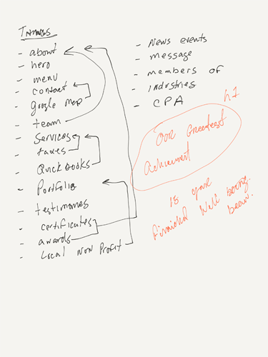
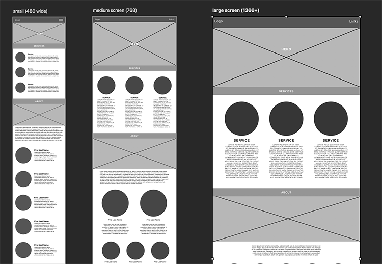
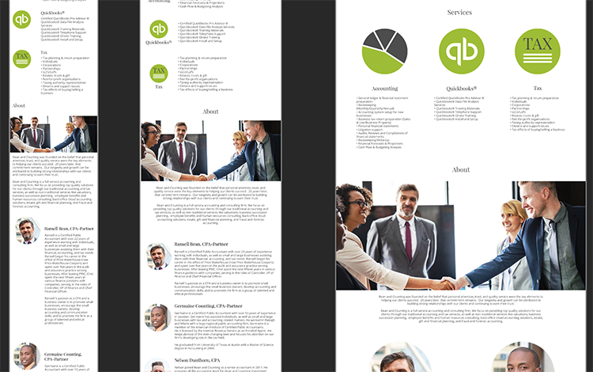

# brutalist 
Single page site constructed only using HTML and CSS.  
  

***Summation of Aaron Gustafson importance of Progressive Enhancements***  

• Core tasks can always be achieved without JavaScript.  
• Core tasks should be done on the most stable layer (i.e. not JavaScript).  
• Progressive Enhancements is not anti-JavaScript. It is just about embracing the right technologies on the right layer.  
• “Because there is some chance JavaScript won’t run, we must always account for that chance.”  
• It’s never a good idea to ignore potential users.  
• Progressive Enhancements is just good engineering.

## Features

• Custom media queries created based on site design and functionality.   
• Custom svgs logos and assets.  
• Using system fonts so there is no external asset loading required. Rendering well on every mainstream operating system and helping to reduce the overall page weight.

## Project Workflow

### Initial Client meeting  
The client had previous sites built from templates. They had issues with updates and browser support. They wanted a basic site with little to no maintenance and rock solid dependability.
They clearly were looking for a dependency free site. No packages, templates, javascript or cdn dependencies. Using only browser supported html and css.    

***Client Directives***  
1. Dependency free.  
2. Reliability.  
3. Access to all devices.  
4. Clean and simple design.  
5. Single page.  
6. Green palette.  
7. Convey a reliable, serious and friendly presence. 

 

**Wire frame**  
A wire frame was constructed to concentrate on the layout and functionality as a whole.  
Showing page structure, element placement and sizing.  
Determining responsive layout and page assets.  

  

**Client Mock-up**  
A mid- to high-fidelity representation of how the final product will look and a rough idea of how it might function. Filling in the visual details.  
With the framework in place and client approval, using the  designs as a guide coding is done to accurately represent the approved design.  

## Project Challenges
Creating device friendly navigation without the use of javascript.  

## Live Link
http://www.becoskie.com/devPortfolio/vanilla/

## Acknowledgments
1. Aaron Gustafson - Progressive Enhancement [View article](https://www.aaron-gustafson.com/notebook/insert-clickbait-headline-about-progressive-enhancement-here/)
2. Nan Xiao - The Return of the Native Font Stack [View article](https://nanx.me/blog/post/the-return-of-the-native-font-stack/)
3. Mark Caron - Responsive, Pure CSS Off-Canvas Hamburger Menu [View page](https://medium.com/@heyoka/responsive-pure-css-off-canvas-hamburger-menu-aebc8d11d793)

 
